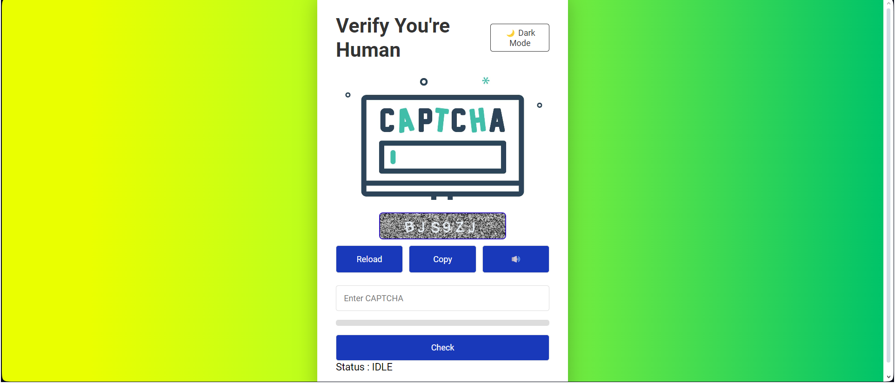
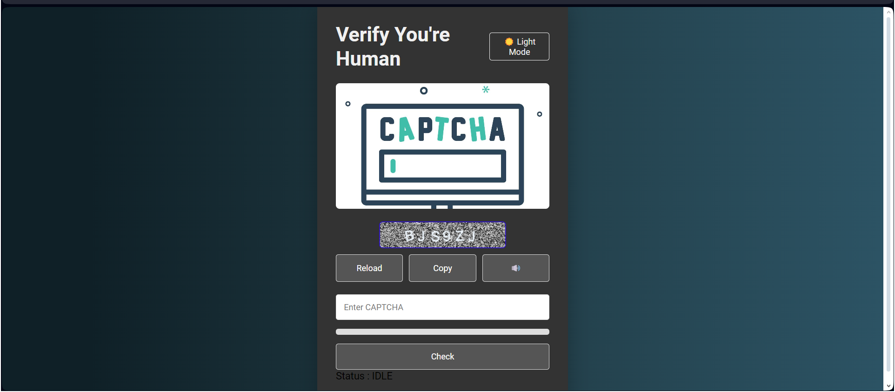

# CAPTCHA Application

A simple and responsive CAPTCHA application built with HTML, CSS, and JavaScript.

## Features

- **CAPTCHA Generation:** Randomly generates a 6-character CAPTCHA using a mix of letters (both uppercase and lowercase) and numbers.
- **CAPTCHA Reload:** Allows users to reload the CAPTCHA if it's difficult to read.
- **CAPTCHA Copy:** Users can easily copy the CAPTCHA text to clipboard.
- **Audio CAPTCHA:** Provides an option to hear the CAPTCHA for accessibility purposes.
- **Dark Mode:** Switch between dark and light mode for better user experience.
- **Progress Bar:** Indicates how many characters the user has entered.
- **Responsive Design:** Ensures a smooth experience on both desktop and mobile devices.

## Installation

1. **Clone the repository:**

    ```bash
    git clone https://github.com/yourusername/captcha-app.git
    ```

2. **Navigate to the project directory:**

    ```bash
    cd captcha-app
    ```

3. **Open `index.html` in your browser:**

    You can open the `index.html` file directly in your browser to see the CAPTCHA application in action.

## Usage

- Enter the CAPTCHA displayed in the input field and click "Check" to validate.
- Use the "Reload" button to generate a new CAPTCHA.
- Click on the "Copy" button to copy the CAPTCHA to clipboard.
- Use the "🔊" button to hear the CAPTCHA read aloud.
- Toggle between dark and light mode using the "Dark Mode" button.

## Screenshots




## Technologies Used

- HTML
- CSS
- JavaScript

## Contributing

Contributions are welcome! Please feel free to submit a Pull Request.

## License

This project is licensed under the MIT License - see the [LICENSE](LICENSE) file for details.
